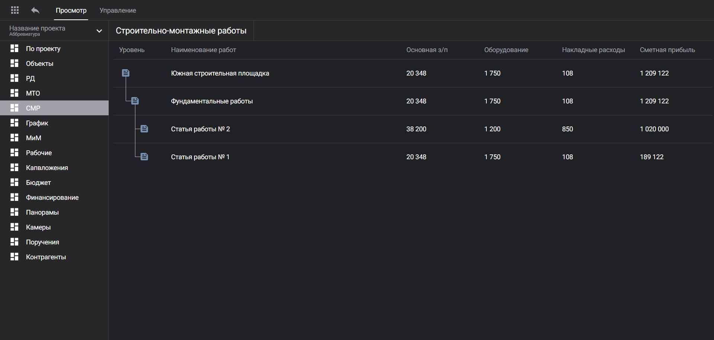
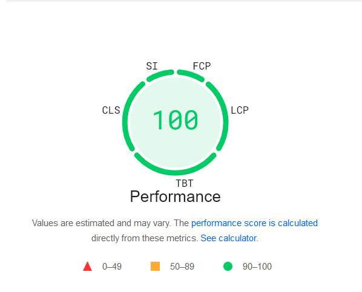

|                               |                                    |
| ----------------------------- | ---------------------------------- |
|  |  |

# Тестовое задание

- 🚀 Бандл **< 100 kB**
- 🛠️ Всего **4** зависимости
- 👌 **Pixel perfect**
- 📦 Линтер и форматтер
- ⚡ Совместим с **Turbopack**

## Установка

Сборка:

```bash
$ npm run build
$ yarn build
$ pnpm build
```

Старт локального сервера:

```bash
$ npm start
$ yarn start
$ pnpm start
```

## Возможные вопросы

> Почему не использовал %moduleName%?

Хотел как можно меньше зависимостей для лучшего фундамента и размера бандла. Всё что мне было нужно я написал сам.

> Почему не использовал RSC?

Для упрощения ревьюверам проверки.

> Что такое korob?

[korob](https://korob.domin.pro) используется как библиотека объединяющая линтер (biome) и форматтер (prettier + biome). Написана мной для упрощения написания библиотек на ноде (до выхода нативной поддержки запуска ts файлов). Чаще использую как тулчейн, но от стандарта в виде еслинта и преттиера не отказываюсь)
